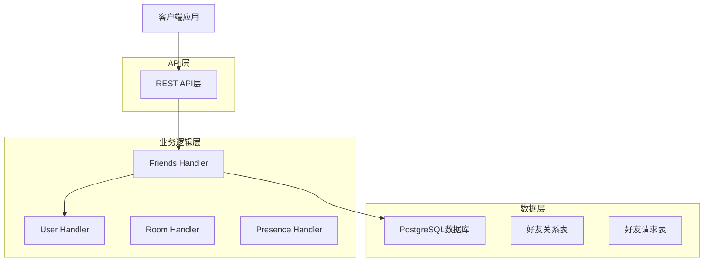
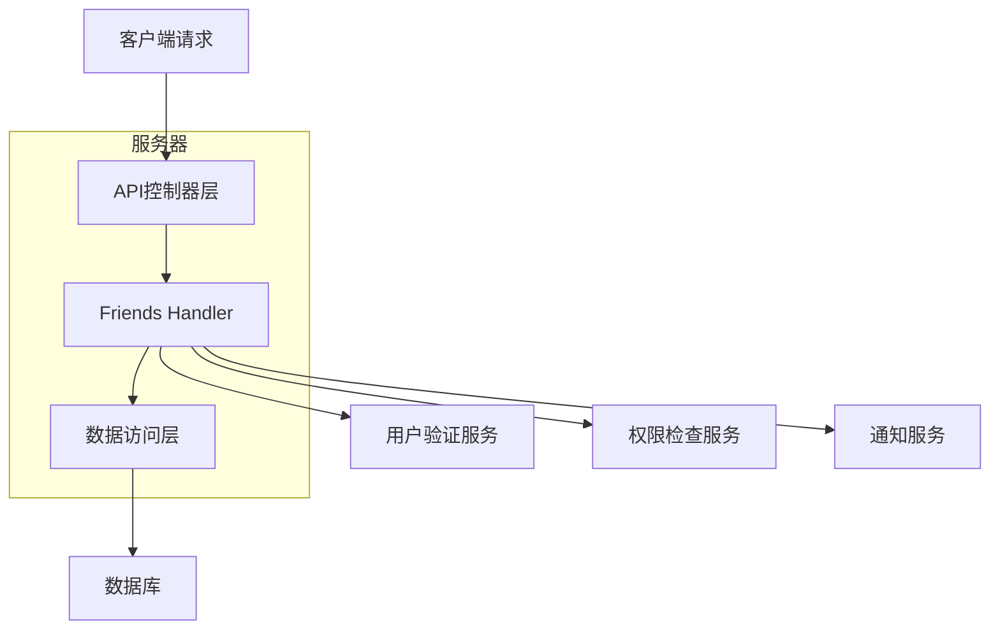
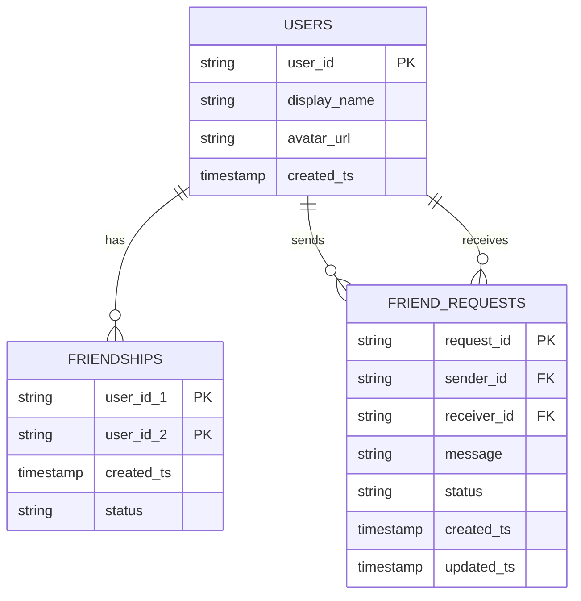

# Synapse好友管理系统技术架构文档

## 1. 架构设计



## 2. 技术描述

- 前端：React@18 + Material-UI@5 + TypeScript
- 后端：Python@3.9 + Twisted + Synapse框架
- 数据库：PostgreSQL@13（复用现有Synapse数据库）
- 缓存：Redis（可选，用于好友状态缓存）

## 3. 路由定义

| 路由 | 用途 |
|------|------|
| /friends | 好友列表页面，显示当前用户的所有好友 |
| /friends/search | 好友搜索页面，搜索和添加新好友 |
| /friends/requests | 好友请求页面，管理收到和发送的好友请求 |
| /friends/:userId | 好友资料页面，显示特定好友的详细信息 |

## 4. API定义

### 4.1 核心API

#### 获取好友列表
```
GET /_matrix/client/v1/friends
```

请求参数：
| 参数名 | 参数类型 | 是否必需 | 描述 |
|--------|----------|----------|------|
| limit | integer | false | 返回结果数量限制，默认100 |
| offset | integer | false | 分页偏移量，默认0 |
| status | string | false | 过滤在线状态：online/offline/all |

响应：
| 参数名 | 参数类型 | 描述 |
|--------|----------|------|
| friends | array | 好友列表数组 |
| total_count | integer | 好友总数 |
| has_more | boolean | 是否有更多数据 |

示例：
```json
{
  "friends": [
    {
      "user_id": "@alice:example.com",
      "display_name": "Alice",
      "avatar_url": "mxc://example.com/avatar1",
      "presence": "online",
      "last_active_ts": 1640995200000,
      "friendship_ts": 1640908800000
    }
  ],
  "total_count": 1,
  "has_more": false
}
```

#### 发送好友请求
```
POST /_matrix/client/v1/friends/request
```

请求：
| 参数名 | 参数类型 | 是否必需 | 描述 |
|--------|----------|----------|------|
| user_id | string | true | 目标用户ID |
| message | string | false | 验证消息 |

响应：
| 参数名 | 参数类型 | 描述 |
|--------|----------|------|
| request_id | string | 请求ID |
| status | string | 请求状态 |

示例：
```json
{
  "user_id": "@bob:example.com",
  "message": "我是Alice，希望加你为好友"
}
```

#### 处理好友请求
```
PUT /_matrix/client/v1/friends/request/{request_id}
```

请求：
| 参数名 | 参数类型 | 是否必需 | 描述 |
|--------|----------|----------|------|
| action | string | true | 操作类型：accept/reject/ignore |

响应：
| 参数名 | 参数类型 | 描述 |
|--------|----------|------|
| success | boolean | 操作是否成功 |

#### 删除好友
```
DELETE /_matrix/client/v1/friends/{user_id}
```

响应：
| 参数名 | 参数类型 | 描述 |
|--------|----------|------|
| success | boolean | 删除是否成功 |

#### 搜索用户
```
GET /_matrix/client/v1/friends/search
```

请求参数：
| 参数名 | 参数类型 | 是否必需 | 描述 |
|--------|----------|----------|------|
| q | string | true | 搜索关键词 |
| limit | integer | false | 结果数量限制 |

响应：
| 参数名 | 参数类型 | 描述 |
|--------|----------|------|
| results | array | 搜索结果 |
| limited | boolean | 是否有更多结果 |

## 5. 服务器架构图



## 6. 数据模型

### 6.1 数据模型定义



### 6.2 数据定义语言

#### 好友关系表 (friendships)
```sql
-- 创建好友关系表
CREATE TABLE friendships (
    user_id_1 TEXT NOT NULL,
    user_id_2 TEXT NOT NULL,
    created_ts BIGINT NOT NULL DEFAULT extract(epoch from now()) * 1000,
    status TEXT NOT NULL DEFAULT 'active' CHECK (status IN ('active', 'blocked')),
    PRIMARY KEY (user_id_1, user_id_2),
    FOREIGN KEY (user_id_1) REFERENCES users(name),
    FOREIGN KEY (user_id_2) REFERENCES users(name)
);

-- 创建索引
CREATE INDEX idx_friendships_user_id_1 ON friendships(user_id_1);
CREATE INDEX idx_friendships_user_id_2 ON friendships(user_id_2);
CREATE INDEX idx_friendships_created_ts ON friendships(created_ts DESC);

-- 确保好友关系的双向性约束
CREATE UNIQUE INDEX idx_friendships_bidirectional ON friendships(
    LEAST(user_id_1, user_id_2), 
    GREATEST(user_id_1, user_id_2)
);
```

#### 好友请求表 (friend_requests)
```sql
-- 创建好友请求表
CREATE TABLE friend_requests (
    request_id TEXT PRIMARY KEY DEFAULT gen_random_uuid()::text,
    sender_id TEXT NOT NULL,
    receiver_id TEXT NOT NULL,
    message TEXT,
    status TEXT NOT NULL DEFAULT 'pending' CHECK (status IN ('pending', 'accepted', 'rejected', 'ignored', 'cancelled')),
    created_ts BIGINT NOT NULL DEFAULT extract(epoch from now()) * 1000,
    updated_ts BIGINT NOT NULL DEFAULT extract(epoch from now()) * 1000,
    FOREIGN KEY (sender_id) REFERENCES users(name),
    FOREIGN KEY (receiver_id) REFERENCES users(name)
);

-- 创建索引
CREATE INDEX idx_friend_requests_sender_id ON friend_requests(sender_id);
CREATE INDEX idx_friend_requests_receiver_id ON friend_requests(receiver_id);
CREATE INDEX idx_friend_requests_status ON friend_requests(status);
CREATE INDEX idx_friend_requests_created_ts ON friend_requests(created_ts DESC);

-- 防止重复请求的唯一约束
CREATE UNIQUE INDEX idx_friend_requests_unique_pending ON friend_requests(
    sender_id, receiver_id
) WHERE status = 'pending';
```

#### 初始化数据
```sql
-- 插入测试数据（可选）
INSERT INTO friend_requests (sender_id, receiver_id, message, status)
VALUES 
    ('@alice:example.com', '@bob:example.com', '你好，我是Alice', 'pending'),
    ('@bob:example.com', '@charlie:example.com', '希望成为朋友', 'accepted');

INSERT INTO friendships (user_id_1, user_id_2, status)
VALUES 
    ('@bob:example.com', '@charlie:example.com', 'active');
```