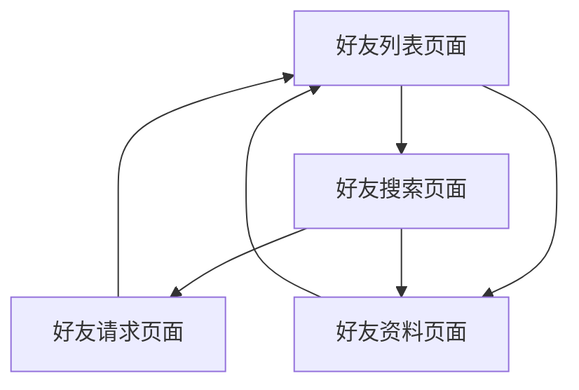

# Synapse好友管理系统产品需求文档

## 1. 产品概述

本文档描述了为Synapse Matrix服务器添加好友管理系统的产品需求。该系统将在现有Matrix协议基础上，实现类似微信的好友关系管理功能，提升用户的社交体验。

- 目标：在保持Matrix联邦化特性的同时，为用户提供直观的好友管理界面和功能
- 解决问题：简化用户发现和连接流程，提供更友好的社交体验
- 市场价值：增强Synapse在即时通讯领域的竞争力，吸引更多用户使用

## 2. 核心功能

### 2.1 用户角色

| 角色 | 注册方式 | 核心权限 |
|------|----------|----------|
| 普通用户 | 邮箱/用户名注册 | 可发送好友请求、管理好友列表、搜索用户 |
| 管理员用户 | 管理员邀请 | 拥有普通用户权限，可管理用户关系、查看系统统计 |

### 2.2 功能模块

我们的好友管理系统包含以下主要页面：
1. **好友列表页面**：显示当前好友、在线状态、快速聊天入口
2. **好友搜索页面**：用户搜索、添加好友、查看用户资料
3. **好友请求页面**：管理收到的好友请求、查看发送的请求状态
4. **好友资料页面**：查看好友详细信息、聊天记录、管理好友关系

### 2.3 页面详情

| 页面名称 | 模块名称 | 功能描述 |
|----------|----------|----------|
| 好友列表页面 | 好友列表模块 | 显示所有好友，支持按在线状态分组，提供快速聊天和语音通话入口 |
| 好友列表页面 | 状态显示模块 | 实时显示好友在线状态、最后活跃时间、个性签名 |
| 好友搜索页面 | 用户搜索模块 | 支持用户名、昵称、邮箱搜索，显示搜索结果和用户基本信息 |
| 好友搜索页面 | 添加好友模块 | 发送好友请求，支持添加验证消息，查看请求状态 |
| 好友请求页面 | 请求管理模块 | 显示收到的好友请求列表，支持接受、拒绝、忽略操作 |
| 好友请求页面 | 发送记录模块 | 查看已发送的好友请求状态，支持撤销未处理的请求 |
| 好友资料页面 | 资料展示模块 | 显示好友详细资料、共同群组、聊天记录统计 |
| 好友资料页面 | 关系管理模块 | 删除好友、设置备注、加入黑名单、举报用户 |

## 3. 核心流程

### 普通用户流程
用户首先进入好友列表页面查看现有好友，可以通过搜索页面发现新用户并发送好友请求。收到好友请求后在请求页面进行处理，建立好友关系后可在资料页面管理好友信息。

### 管理员流程
管理员除了拥有普通用户的所有功能外，还可以查看系统中的好友关系统计，处理用户举报，管理异常的好友关系。

## 4. 用户界面设计

### 4.1 设计风格

- 主色调：#1976D2（蓝色），辅助色：#FFC107（橙色）
- 按钮样式：圆角矩形，轻微阴影效果
- 字体：Roboto 14px（正文），16px（标题），12px（辅助信息）
- 布局风格：卡片式设计，顶部导航栏，支持左滑返回
- 图标风格：Material Design图标，简洁现代

### 4.2 页面设计概览

| 页面名称 | 模块名称 | UI元素 |
|----------|----------|--------|
| 好友列表页面 | 好友列表模块 | 头像圆形显示，在线状态绿点标识，卡片式布局，支持下拉刷新 |
| 好友搜索页面 | 搜索模块 | 顶部搜索框，实时搜索结果，用户卡片展示，添加按钮突出显示 |
| 好友请求页面 | 请求列表 | 时间轴式布局，请求状态标签，接受/拒绝按钮，滑动操作支持 |
| 好友资料页面 | 资料展示 | 大头像展示，信息分组显示，操作按钮底部固定，支持分享功能 |

### 4.3 响应式设计

产品采用移动端优先设计，支持桌面端自适应布局，针对触摸操作进行优化，支持手势导航和快捷操作。